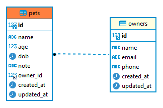

# Pet-API
This project was built on purpose to learn CRUD API using [AdonisJS](https://adonisjs.com/).

## Prerequisites
- Node.js (>= v16.16.0)
- npm (>= v8.14.0)
- MySQL (>= v8.0.28)

## Install & run
- Clone project `https://github.com/Qitaal/Pet-API.git`
- Install dependencies `npm install`
- Migrate database schema `node ace migration:run`
- Run server `npm run dev`

## ERD


## API
### Owner
- **Create owner**
```
curl --request POST \
  --url http://127.0.0.1:3333/owners \
  --header 'Content-Type: application/json' \
  --data '{
	"name": "Madah Ismail",
	"email": "mdhisml@gmail.com",
	"phone": "8184015978"
}'
```

- **Get all owner**
```
curl --request GET \
  --url http://127.0.0.1:3333/owners
```

- **Get owner by id**
```
curl --request GET \
  --url http://127.0.0.1:3333/owners/1
```

- **Update owner**
```
curl --request PUT \
  --url http://127.0.0.1:3333/owners/1 \
  --header 'Content-Type: application/json' \
  --data '{
	"name": "Thalib ABu QItaal updated",
	"email": "thalib74@gmail.com",
	"phone": "+628164240445"
}'
```

- **Delete owner**
```
curl --request DELETE \
  --url http://127.0.0.1:3333/owners/2
```


### Pet
- **Create pet**
```
curl --request POST \
  --url http://127.0.0.1:3333/pets \
  --header 'content-type: application/json' \
  --data '{
	"name": "thalib",
	"age": 12,
	"dob": "2022-10-20",
	"owner_id": 1
}'
```

- **Get all pet**
```
curl --request GET \
  --url http://127.0.0.1:3333/pets
```

- **Get pet by id**
```
curl --request GET \
  --url http://127.0.0.1:3333/pets/1
```

- **Update pet**
```
curl --request PUT \
  --url http://127.0.0.1:3333/pets/2 \
  --header 'Content-Type: application/json' \
  --data '{
	"name": "Qitaal",
	"age": 12,
	"dob": "2022-10-20",
	"note": "anjing hitam"
}'
```

- **Delete owner**
```
curl --request DELETE \
  --url http://127.0.0.1:3333/pets/3
```
